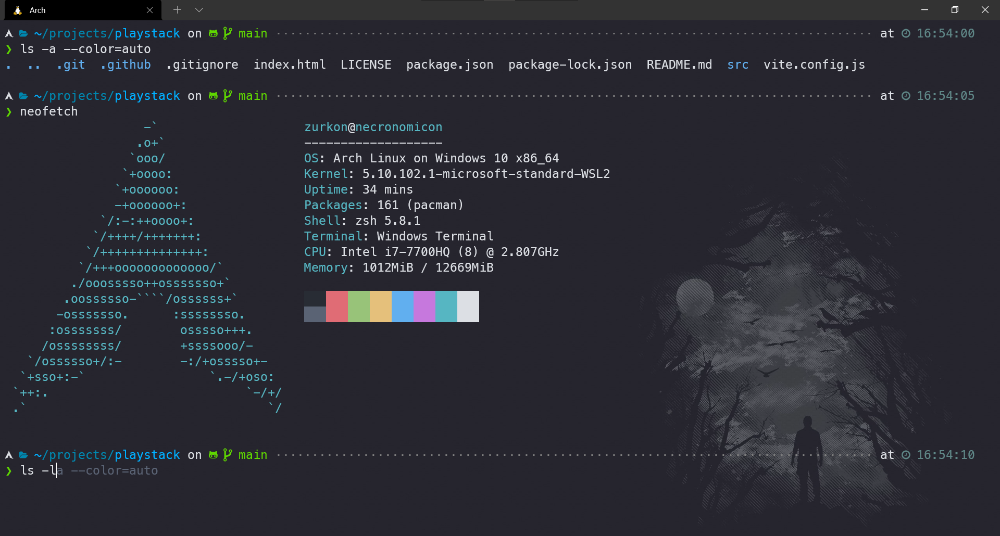

# WSL Arch Setup
Step-by-step tutorial to Setup Dev Environment using Arch on WSL2



# Getting Started

## Installing WSL

Open `powershell` as admin and run the following comand to install `wsl`:

```
wsl --install
```

Wait until finish installation, restart the computer.

By default, `wsl` install Ubuntu for you and you will be prompted to create a default **User** for Ubuntu and a **password**.

## Installing Windows Terminal

Install the `Windows Terminal` from [Microsoft Store](https://www.microsoft.com/pt-br/p/windows-terminal/9n0dx20hk701).

## Installing Arch

1. To install, [`Download`](https://github.com/yuk7/ArchWSL/releases/latest) the installer zip from `ArchWSL` repository.

2. Extract the files to a folder that you have write permission. 
> **Obs**: Don't extract to `C:\Program Files`

3. Run `Arch.exe` to extract the rootfs and register to WSL.

## Set up the default user

By default, Arch Linux starts with root privileges. 

We need to create a default user.

On Arch:

setup the `sudoers` file:

```
root@PC-NAME]# echo "%wheel ALL=(ALL) ALL" > /etc/sudoers.d/wheel
```

add the username:
```
[root@PC-NAME]# useradd -m -G wheel -s /bin/bash {username}
(add user)
```

add the username's password:
```
[root@PC-NAME]# passwd {username}
(set default user password)
```


Open `powershell` or `cmd` then run `Arch.exe` again with some parameters:
```
>Arch.exe config --default-user {username}
(setting to default user)
```

## Initialize keyring

Execute these commands to initialize the keyring.
> **Obs**: This step is necessary to use pacman.

```
[user@PC-NAME]$ sudo pacman-key --init

[user@PC-NAME]$ sudo pacman-key --populate

[user@PC-NAME]$ sudo pacman -Syy archlinux-keyring
```

Now you can update the pacman:

```
[user@PC-NAME]$ sudo pacman -Syyuu
```

## Installing YAY

First, you need to install `yay` dependencies: `git` and `base-devel`.

```
sudo pacman -S git base-devel
```

Now git clone [`yay`](https://github.com/Jguer/yay) AUR repository.

```
git clone https://aur.archlinux.org/yay.git
```

> **Tip**: You can git clone on `/tmp` folder if you need to file only for installation, like this one.

Change to `yay` repo folder, then build:

```
cd yay
makepkg -si
```

## Installing ZSH and Powerlevel10k

Since we installed `yay`, our life will be more easy.

Installing `zsh`:
```
yay -S zsh
```

> **Obs**: You can use the `yay -Rns [package]` command to remove an installed package and its dependencies.

Installing `powerlevel10k`
```
yay -S --noconfirm zsh-theme-powerlevel10k-git
```

`powerlevel10k` have some optional fonts:
```
yay -S ttf-meslo-nerd-font-powerlevel10k powerline-fonts awesome-terminal-fonts
```

Saving `powerlevel10k` on `zsh` config file:
```
echo 'source /usr/share/zsh-theme-powerlevel10k/powerlevel10k.zsh-theme' >>~/.zshrc
```

Change the default Arch Shell:
```
chsh -s /usr/bin/zsh
```

Restart `Arch`, then `Powerlevel10k` will be prompt to help you custom your `ZSH Theme`.

The first time, you will see some gibberish 'cause you need to install [`MesloLGS NF fonts`](https://github.com/romkatv/powerlevel10k/blob/master/font.md#manual-font-installation). 

Install all the 4 fonts. (Regular, Bold, Italic and Bold Italic)

Change the Windows Terminal Font Family to `MesloLGS NF`.

Finish the `Powerlevel10k` theme configuration.

> **Obs**: If you like to prompt these CLI config again to change your theme, you can use `p10k configure` command.


I like to install [`zsh-autosuggestions`](https://github.com/zsh-users/zsh-autosuggestions) for produtivity.

Create a `.zsh` folder on your home folder (aka `~`).
```
mkdir .zsh

git clone https://github.com/zsh-users/zsh-autosuggestions ~/.zsh/zsh-autosuggestions
```

Add the following to your `.zshrc`:
```
source ~/.zsh/zsh-autosuggestions/zsh-autosuggestions.zsh
```

## Installing ASDF for Programming Language Version Control

We can install using `yay`:
```
yay -S asdf-vm
```

Add the following to your `.zshrc`:
```
source /opt/asdf-vm/asdf.sh
```

### Installing languages

You can install with `plugin add` command to add the language plugin:
```
asdf plugin add nodejs
```

You can list all versions available of that language with `list-all`:
```
asdf list-all nodejs
```


Then install a specific version of the language:
```
asdf install nodejs 14.16.0
```

Set up a **global** version:
```
asdf global nodejs 14.16.0
```

Set up locally for a project folder:
```
asdf local nodejs 14.16.0
```

> **Obs**: You need to config a **global** version if you need to use on your system, otherwise `node --version` won't work.

## References

[`ArchWSL`](https://github.com/yuk7/ArchWSL) - ArchLinux based WL Distribution.

[`yay`](https://github.com/Jguer/yay) - Yet another Yogurt - An AUR Helper written in Go.

[`powerlevel10k`](https://github.com/romkatv/powerlevel10k) - A ZSH Theme.

[`zsh-autosuggestions`](https://github.com/zsh-users/zsh-autosuggestions) - Fish-like autosuggestions for zsh.

[`ASDF Docs`](https://asdf-vm.com/guide/introduction.html) - Documentation for `asdf` tool version manager.
